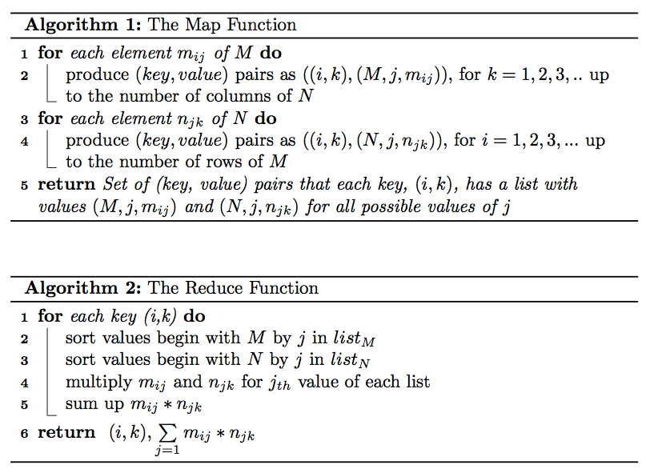
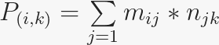
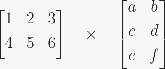
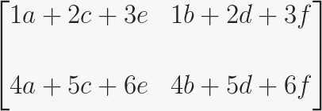

# Sparse Matrix Multiplication with Hadoop

Matrix-vector and matrix-matrix calculations fit nicely into the MapReduce style of computing. In this post I will only 
examine matrix-matrix calculation as described in [1, ch.2].

Suppose we have a *p x q* matrix M, whose element in row i and column j will be denoted m<sub>ij</sub> and a *q x r* 
matrix N whose element in row *j* and column *k* is donated by *n<sub>jk</sub>* then the product *P = MN* will be *p x r* 
matrix P whose element in row *i* and column *k* will be donated by *P<sub>ik</sub>*, where *P(i,k) = m<sub>ij</sub>\*n<sub>jk</sub>*


## Matrix Data Model for MapReduce

We represent matrix M as a relation *M(I,J,V)*, with tuples *(i,j,m<sub>ij</sub>)*, and matrix N as a relation 
*N(J,K,W)*, with tuples *(j,k,n<sub>jk</sub>)*. Most matrices are sparse so large amount of cells have value zero. 
When we represent matrices in this form, we do not need to keep entries for the cells that have values of zero to save 
large amount of disk space. As input data files, we store matrix M and N on HDFS in following format:

*M,i,j,m<sub>ij</sub>*

```bash
 M,0,0,10.0
 M,0,2,9.0
 M,0,3,9.0
 M,1,0,1.0
 M,1,1,3.0
 M,1,2,18.0
 M,1,3,25.2
 ....
```

N,j,k,n<sub>jk</sub>

```bash
 N,0,0,1.0
 N,0,2,3.0
 N,0,4,2.0
 N,1,0,2.0
 N,3,2,-1.0
 N,3,6,4.0
 N,4,6,5.0
 N,4,0,-1.0
 ....
```

## Map-Reduce
We will write Map and Reduce functions to process input files. Map and reduce functions will implement the following 
algorithms:


Map function will produce *key,value* pairs from the input data as it is described in *Algorithm 1*. Reduce function 
uses the output of the Map function and performs the calculations and produces *key,value* pairs as described in 
*Algorithm 2*. All outputs are written to HDFS. The value in row i and column k of product matrix P will be:



Let me examine the algorithms on an example to explain better. Suppose we have two matrices, M, 2x3 matrix, and N, 3x2 
matrix as follows:



The product P of MN will be as follows:



### The Map Task

For matrix M, map task (Algorithm 1) will produce *key,value* pairs as follows:

(i,k), (M, j, m<sub>ij</sub>)

*m<sub>11</sub> = 1* \
*(1,1), (M, 1, 1) for k = 1* \
*(1,2), (M, 1, 1) for k = 2*

*m<sub>12</sub> = 2* \
*(1,1), (M, 2, 2) for k = 1* \
*(1,2), (M, 2, 2) for k = 2*

.........

*m<sub>23</sub> = 6* \
*(2,1), (M, 3, 6) for k = 1* \
*(2,2), (M, 3, 6) for k = 2*

For matrix N, map task (Algorithm 2) will produce *key,value* pairs as follows:


*(i,k),(N,j,n<sub>jk</sub>)*

n<sub>11</sub> = a \
*(1,1),(N,1,a) for i = 1* \
*(2,1),(N,1,a) for i = 2*

*n<sub>21</sub> = c* \
*(1,1),(N,2,c) for i = 1* \
*(2,1),(N,2,c) for i = 2*

*n<sub>31</sub> = e* \
*(1,1),(N,3,e) for i = 1* \
*(2,1),(N,3,e) for i = 2*

.......

*n<sub>32</sub> = f* \
*(1,2),(N,3,f) for i = 1* \
*(2,2),(N,3,f) for i = 2*

After combine operation the map task will return *key,value* pairs will look like as follows:

*( (i,k), [ (M, j, m<sub>ij</sub> ), (M, j, m<sub>ij</sub> ),..., (N, j, n<sub>jk</sub>), (N, j, n<sub>jk</sub>), .... ] )* \
*(1,1), [(M,1,1),(M,2,2),(M,3,3),(N,1,a,(N,2,c),(N,3,e)]* \
*(1,2), [(M,1,1),(M,2,2),(M,3,3),(N,1,b,(N,2,d),(N,3,f)]* \
*(2,1), [(M,1,4),(M,2,5),(M,3,6),(N,1,a,(N,2,c),(N,3,e)]* \
*(2,2), [(M,1,4),(M,2,5),(M,3,6),(N,1,b,(N,2,d),(N,3,f)]*

Note that the entries for the same key are grouped in the same list, which is performed by the framework. This
output will be stored in HDFS and feed the reduce task as input.

### The Reduce Task

Reduce task takes the `key,value` pairs as the input and process one key at a time. For each key it divides the
values in two separate lists for `M` and `N`. As an example, it will create the following list for key  
*(1,1)*: *[(M,1,1),(M,2,2),(M,3,3),(N,1,a,(N,2,c),(N,3,e)]*

Reduce task sorts the values begin with M in one list and values begin with N in another list as follows:

*l<sub>M</sub> = [(M,1,1),(M,2,2),(M,3,3)]* \
*l<sub>N</sub> = [(N,1,a),(N,2,c),(N,3,e)]*

then sums up the multiplication of m<sub>ij</sub> and n<sub>jk</sub> for each j as follows:

*P(1,1) = 1a + 2c + 3e*

The same computation applied to all input entries of reduce task.


for all i and k is then calculated as follows:_3

```bash
P(1,1) = 1a + 2c + 3e
P(1,2) = 1b + 2d + 3f
P(2,1) = 4a + 5c + 6e
P(2,2) = 4b + 5d + 6f
```

The product matrix P of MN is then generated as:


### Experiments

#### Data

I have setup a single node Hadoop installation with HDFS and run the matrix calculation experiment on this installation.
I used 1000 x 100 matrix M and 100 x 1000 matrix N with sparsity level of 0.3. This means each matrix has about 30K 
entries. The matrix les M and N stored in input directory on HDFS and the output of the computation is stored in output 
directory on HDFS.

#### Source Code

Mapper and reducer classes are `Map.java` and `Reduce.java` respectively. Main method in the `MatrixMultiply.java` 
class the configuration parameters are being set as well as the input/output directories of MapReduce job [2].

The Mapper class extends org.apache.hadoop.mapreduce.Mapper class and implements the map task described in Algorithm 1 
and creates the *key,value* pairs from the input files.

Reducer class extends org.apache.hadoop.mapreduce.Reducer class and implements the reduce task described in Algorithm 2 
and creates the *key,value* pairs for the product matrix then writes its output to HDFS.


Need Help?
---
Check out this tutorial to setup your local environment to run Hadoop map-reduce jobs:
http://hadoop.apache.org/docs/current/hadoop-mapreduce-client/hadoop-mapreduce-client-core/MapReduceTutorial.html

References
--

[1] Anand Rajaraman and Jerey David Ullman. Mining of Massive Datasets.
Cambridge University Press, New York, NY, USA, 2011.

[2] One-step matrix multiplication with hadoop, [Online], 2014

